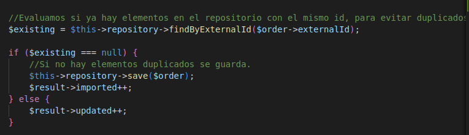
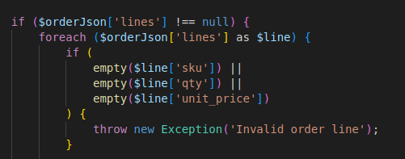
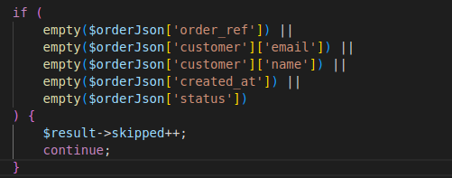

# prueba_ganbaru

<em> Instalación de aplicación PHP_GAMBARU en Linux </em>

1. Instalación de php en el equipo:

* Actualiza los repositorios e instala PHP:

    sudo apt update
    sudo apt install php

* Herramientas habituales para desarrollo:

    sudo apt install php php-cli php-mbstring php-xml php-curl php-zip

* Comprobamos que se ha instalado correctamente la versión actual de php:

    php -v

2. Ejecución del programa:

* Navegamos hasta la carpeta donde hemos descargado el proyecto:

    cd ~/php_gambaru

* Ejecutamos sobre el fichero principal order.php

    php init.php

<em> Respuestas al cuestionario </em>

2. Pues utilizaría las dos tablas que se me plantean: pedidos y otra linea_pedido.
Utilizaría en cada una de ellas los atributos de las clases Order y OrderLine, añadiendo un id a cada uno de ellos, y un order_line como campo adicional en la tabla de pedidos como clave foránea a la tabla linea_pedido.
El upsert lo hago mediante el código, no sabría hacerlo mediante SQL. 
Prepare statement hace mucho que no lo utilizo, tendría que mirarlo con más detenimiento.

4. 

5. Yo creo que si que los cargaría en memoria porque se llama directamente al la función
que ejecuta la llamada al fichero json y trae todos los datos directamente para almacenarlos 
en la variable $orders.
Los recorro mediante un foreach porque es la estructura más cómoda que utilizo para recorrer
un array asociativo.

6. Si algún pedido llega incompleto tanto en los datos del Order como en los del OrderLine 
compruebo antes si alguno de ellos está vacío con empty, que permite saber si el valor es válido 
y llega con contenido.
Se continua con el resto de la ejecución de los pedidos al utilizar continue en la comprobación.

7. No sabría responder.

8. En principio me convence toda.

9. Creo que lo soportaría ya que cada pedido seguiría teniendo su propio identificador único independientemente de la hora en la que se esté ejecutando.
